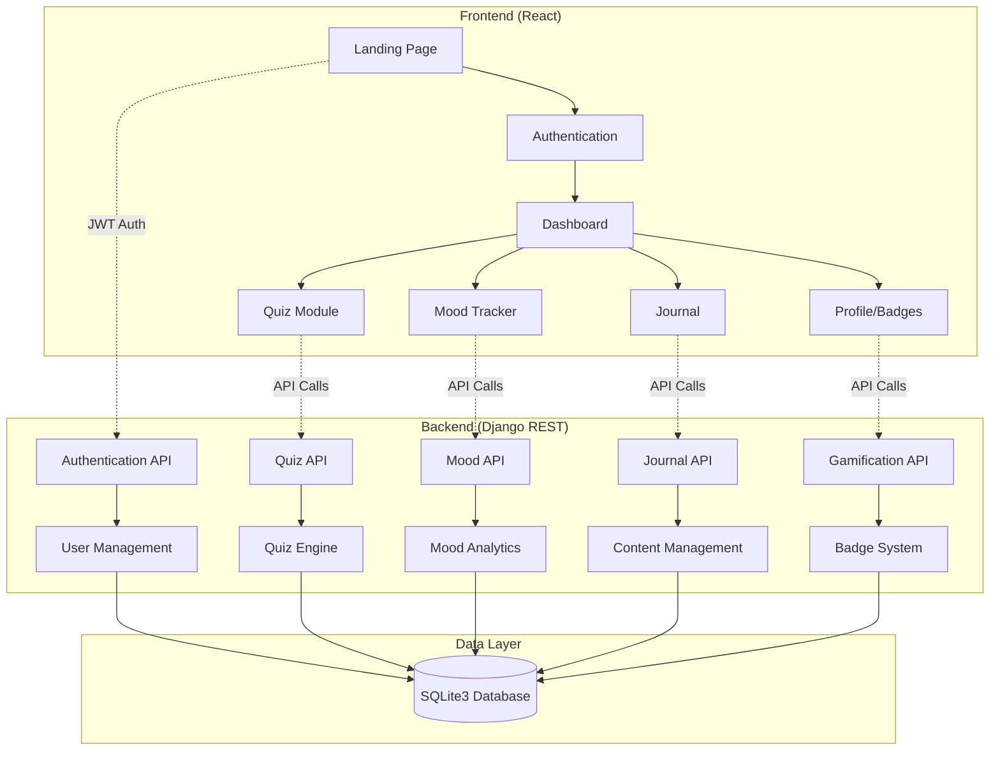

# Design Document

## Overview

CuraCore leverages an existing React frontend that needs to be integrated with a new Django REST Framework backend. The focus is on building robust API services with JWT-based stateless authentication and SQLite3 for data persistence, then connecting the existing frontend components to these new backend endpoints.

The application follows API-first design principles, building backend services that match the existing frontend's data requirements. The architecture emphasizes seamless integration between the existing React UI and new Django backend through well-defined API contracts.

## Architecture

### System Architecture



### Technology Stack

**Backend:**
- Django 4.2.7 with Django REST Framework 3.14.0
- djangorestframework-simplejwt 5.3.0 for JWT authentication
- SQLite3 database (Django default)
- drf-spectacular for OpenAPI documentation
- django-cors-headers for frontend integration

**Frontend:**
- React 18.2.0 with React Router DOM 6.3.0
- Tailwind CSS for styling with Framer Motion for animations
- Recharts for mood visualization
- Lucide React for icons
- Axios for API communication

## Components and Interfaces

### Backend Django Apps Structure

```
curacore-backend/
├── curacore/                 # Main project settings
│   ├── settings.py          # JWT, CORS, database config
│   ├── urls.py              # Main URL routing
│   └── wsgi.py              # WSGI application
├── users/                   # User management app
│   ├── models.py            # User model extensions
│   ├── serializers.py       # User data serialization
│   ├── views.py             # Auth endpoints
│   └── urls.py              # User routes
├── quizzes/                 # Quiz management app
│   ├── models.py            # Quiz, QuizResult models
│   ├── serializers.py       # Quiz data serialization
│   ├── views.py             # Quiz CRUD endpoints
│   └── urls.py              # Quiz routes
├── mood/                    # Mood tracking app
│   ├── models.py            # MoodLog model
│   ├── serializers.py       # Mood data serialization
│   ├── views.py             # Mood endpoints
│   └── urls.py              # Mood routes
├── journal/                 # Journal app
│   ├── models.py            # JournalEntry model
│   ├── serializers.py       # Journal serialization
│   ├── views.py             # Journal endpoints
│   └── urls.py              # Journal routes
└── gamification/            # Badge and streak app
    ├── models.py            # Badge model
    ├── serializers.py       # Badge serialization
    ├── views.py             # Badge endpoints
    └── urls.py              # Badge routes
```

### Frontend Integration Points

The existing React frontend will be enhanced with:

**New API Integration Layer:**
```
src/lib/
├── api.js               # Axios client for backend communication
├── auth.js              # JWT token management
└── endpoints.js         # API endpoint definitions
```

**Enhanced Context Providers:**
```
src/contexts/
├── AuthContext.js       # JWT auth state management
└── ApiContext.js        # Global API state management
```

**New Custom Hooks:**
```
src/hooks/
├── useAuth.js           # Authentication hook
├── useApi.js            # API calling hook
└── useQuiz.js           # Quiz-specific API hook
```

The existing components will be updated to consume backend APIs rather than using mock data.

### API Endpoints Design

**Authentication Endpoints:**
```
POST /api/auth/register/     # User registration
POST /api/auth/login/        # User login (returns JWT)
POST /api/auth/refresh/      # JWT token refresh
POST /api/auth/logout/       # Logout (blacklist token)
```

**User Endpoints:**
```
GET /api/users/profile/      # Get user profile
PUT /api/users/profile/      # Update user profile
GET /api/users/stats/        # Get user statistics
```

**Quiz Endpoints:**
```
GET /api/quizzes/            # List all quizzes
GET /api/quizzes/{id}/       # Get specific quiz
POST /api/quizzes/{id}/submit/ # Submit quiz answers
GET /api/quiz-results/       # Get user's quiz results
```

**Mood Endpoints:**
```
POST /api/mood/logs/         # Create mood log
GET /api/mood/logs/          # Get user's mood logs
GET /api/mood/analytics/     # Get mood analytics
```

**Journal Endpoints:**
```
POST /api/journal/entries/   # Create journal entry
GET /api/journal/entries/    # Get user's journal entries
PUT /api/journal/entries/{id}/ # Update journal entry
DELETE /api/journal/entries/{id}/ # Delete journal entry
```

**Gamification Endpoints:**
```
GET /api/badges/             # Get user's badges
POST /api/badges/check/      # Check for new badges
GET /api/streaks/            # Get user's streak info
```

## Data Models

### User Model (Extended Django User)
```python
class UserProfile(models.Model):
    user = models.OneToOneField(User, on_delete=models.CASCADE)
    streak = models.IntegerField(default=0)
    last_activity = models.DateTimeField(auto_now=True)
    created_at = models.DateTimeField(auto_now_add=True)
```

### Quiz Models
```python
class Quiz(models.Model):
    title = models.CharField(max_length=200)
    questions = models.JSONField()  # Stores quiz questions and options
    created_at = models.DateTimeField(auto_now_add=True)

class QuizResult(models.Model):
    user = models.ForeignKey(User, on_delete=models.CASCADE)
    quiz = models.ForeignKey(Quiz, on_delete=models.CASCADE)
    score = models.IntegerField()
    answers = models.JSONField()  # Store user answers
    date = models.DateTimeField(auto_now_add=True)
```

### Mood Model
```python
class MoodLog(models.Model):
    user = models.ForeignKey(User, on_delete=models.CASCADE)
    mood_level = models.IntegerField(validators=[MinValueValidator(1), MaxValueValidator(10)])
    note = models.TextField(blank=True)
    date = models.DateTimeField(auto_now_add=True)
```

### Journal Model
```python
class JournalEntry(models.Model):
    user = models.ForeignKey(User, on_delete=models.CASCADE)
    text = models.TextField()
    date = models.DateTimeField(auto_now_add=True)
    updated_at = models.DateTimeField(auto_now=True)
```

### Badge Model
```python
class Badge(models.Model):
    name = models.CharField(max_length=100)
    description = models.TextField()
    icon = models.CharField(max_length=50)  # Icon identifier

class UserBadge(models.Model):
    user = models.ForeignKey(User, on_delete=models.CASCADE)
    badge = models.ForeignKey(Badge, on_delete=models.CASCADE)
    earned_date = models.DateTimeField(auto_now_add=True)
```

## Error Handling

### Backend Error Handling
- Custom exception handlers for DRF
- Standardized error response format
- JWT token validation errors
- Database constraint violations
- Input validation errors

### Frontend Error Handling
- Axios interceptors for global error handling
- Toast notifications for user feedback
- Retry mechanisms for network failures
- JWT token expiration handling
- Form validation errors

### Error Response Format
```json
{
  "error": true,
  "message": "User-friendly error message",
  "details": "Technical details for debugging",
  "code": "ERROR_CODE"
}
```

## Testing Strategy

### Backend Testing
- Unit tests for models and serializers
- API endpoint testing with DRF test client
- JWT authentication testing
- Database integrity tests
- Permission and authorization tests

### Frontend Testing
- Component unit tests with React Testing Library
- Integration tests for API calls
- Authentication flow testing
- User interaction testing
- Responsive design testing

### Test Coverage Goals
- Backend: 90% code coverage
- Frontend: 80% component coverage
- Critical paths: 100% coverage (auth, data persistence)

## Security Considerations

### JWT Security
- Short-lived access tokens (15 minutes)
- Refresh token rotation
- Token blacklisting on logout
- Secure token storage practices

### API Security
- CORS configuration for frontend domain
- Rate limiting on authentication endpoints
- Input sanitization and validation
- SQL injection prevention through ORM

### Data Privacy
- User data isolation through foreign keys
- Sensitive data encryption at rest
- Secure password hashing with Django defaults
- HTTPS enforcement in production

## Performance Optimization

### Backend Optimization
- Database query optimization with select_related
- API response caching for static data
- Pagination for large datasets
- Database indexing on frequently queried fields

### Frontend Optimization
- Code splitting with React.lazy
- Image optimization and lazy loading
- API response caching
- Debounced search and input handling

## Integration Strategy

### Development Environment Setup
- Django backend running on port 8000
- Existing React frontend on port 3000
- CORS configuration to allow frontend-backend communication
- Environment variables for API base URL

### Frontend-Backend Integration
- Replace mock data with real API calls
- Implement JWT token storage and management
- Add error handling for API failures
- Update existing components to work with backend data structures

### API Contract Alignment
- Backend API responses match frontend data expectations
- Consistent error response formats
- Proper HTTP status codes for different scenarios
- Standardized date/time formats across both layers